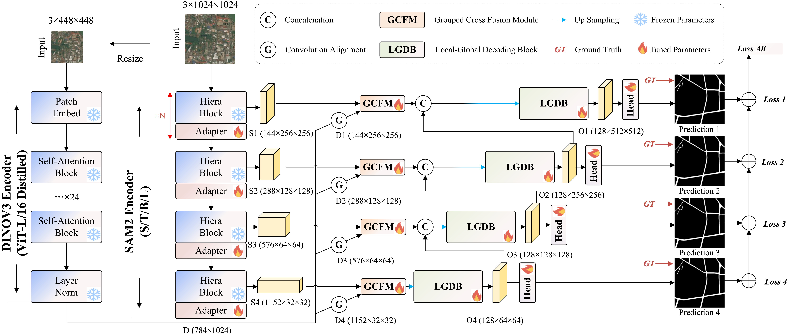

## DSAM-Seg: Towards Limited Labeled Data and Cross-Region Road Extraction by Parameter-Efficient Transfer Learning

## News
-2026/1/21-30 Code is being organized and uploaded.
## Requirements
-Pytorch 2.7.1
## Clone Repository
```shell
git clone https://github.com/Winkness/Segment.git
cd Segment
```
## Get Started Quickly
```shell
conda create -n DSAM-Seg python==3.10
conda activate DSAM-Seg
pip install -r requirements.txt
```
## Datasets
- [DeepGlobe](https://competitions.codalab.org/competitions/18467#participate-get_starting_kit)
- [Massachusetts](https://www.cs.toronto.edu/~vmnih/data/)
- [SpaceNet-Test, From WHU](https://rsidea.whu.edu.cn/GRSet.htm)
- [RoadTracer-Test, From WHU](https://rsidea.whu.edu.cn/GRSet.htm)
## Train
```shell
-cd Segment
-train.sh
```
## Test
```shell
-test.sh
```
## Acknowledgement
[segment anything 2](https://github.com/facebookresearch/segment-anything-2)
[DINOV3](https://github.com/facebookresearch/dinov3.git)
[The GRSet dataset](https://rsidea.whu.edu.cn/GRSet.htm)
